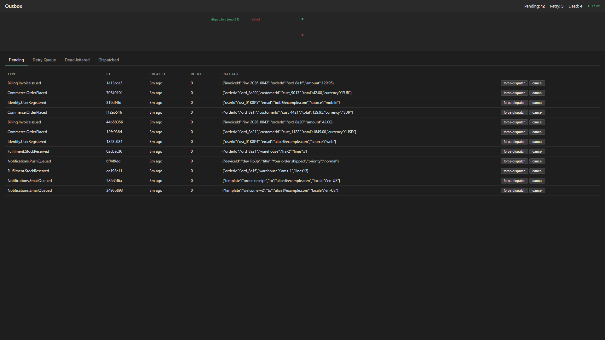
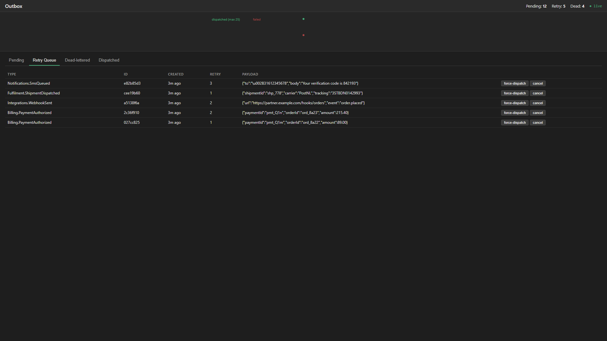
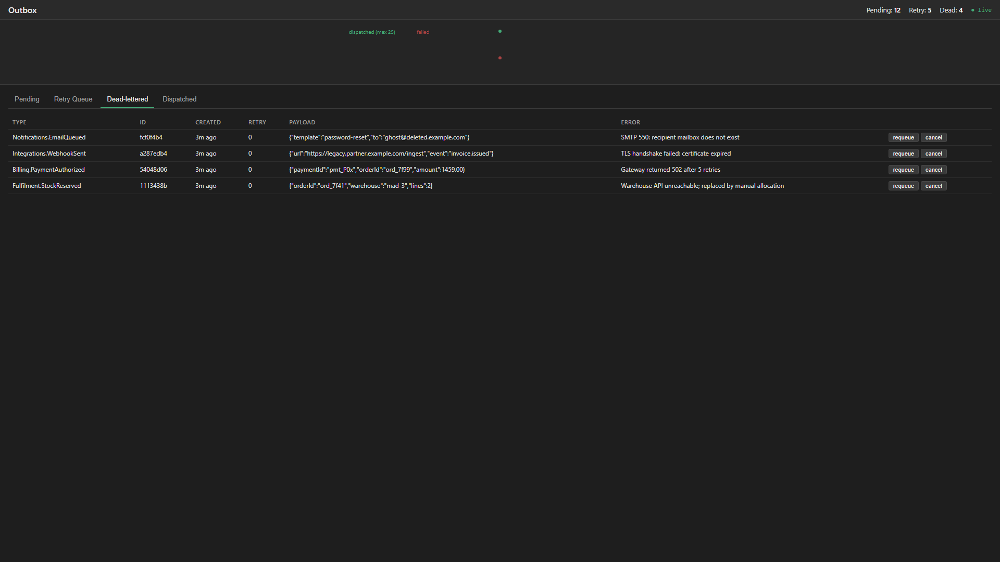
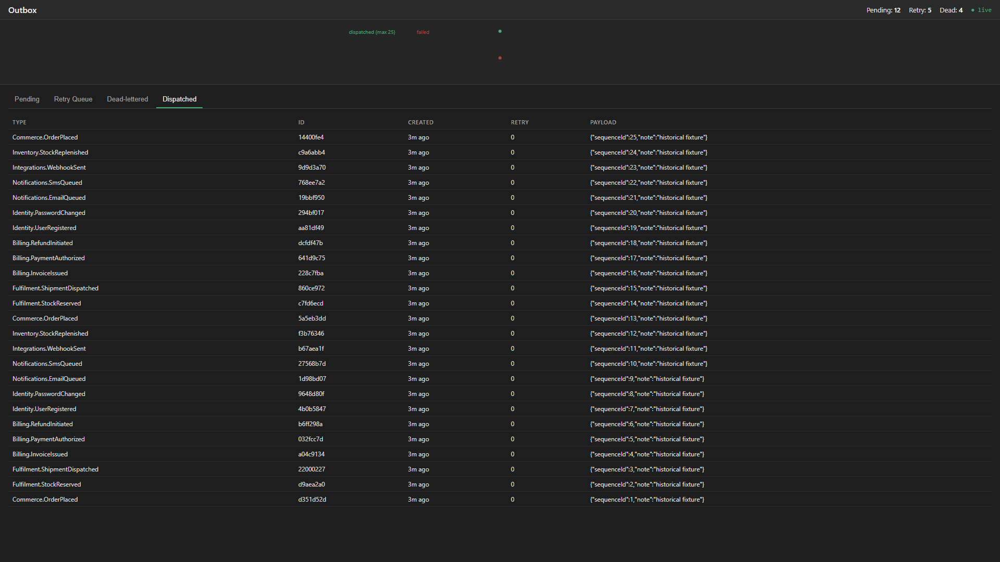

# ZeroAlloc.Outbox

Source-generated transactional outbox for .NET. Annotate a message type with `[OutboxMessage]` and a Roslyn source generator emits a typed writer and dispatcher bridge — no reflection, no boxing, AOT-safe. Backed by EF Core (production) or in-memory (tests), with a built-in polling worker, exponential-backoff retry, and dead-letter support.

[](https://www.nuget.org/packages/ZeroAlloc.Outbox)
[](https://www.nuget.org/packages/ZeroAlloc.Outbox.Generator)
[](https://www.nuget.org/packages/ZeroAlloc.Outbox.EfCore)
[](https://www.nuget.org/packages/ZeroAlloc.Outbox.InMemory)
[](https://github.com/ZeroAlloc-Net/ZeroAlloc.Outbox/actions/workflows/ci.yml)
[](LICENSE)

---

## Install

```bash
# Core abstractions + source generator (always required)
dotnet add package ZeroAlloc.Outbox
dotnet add package ZeroAlloc.Outbox.Generator

# Pick a store:
dotnet add package ZeroAlloc.Outbox.EfCore    # production — Entity Framework Core
dotnet add package ZeroAlloc.Outbox.InMemory  # testing — in-process, no database
```

---

## Quick start

**1. Annotate your message:**

```csharp
using ZeroAlloc.Outbox;

[OutboxMessage]
public sealed record OrderPlaced(int OrderId, decimal Amount);
```

The generator emits `IOutboxWriter<OrderPlaced>` and its DI registration extension.

**2. Register with DI:**

```csharp
builder.Services.AddOutbox(options =>
{
    options.PollingInterval = TimeSpan.FromSeconds(5);
    options.BatchSize       = 50;
    options.MaxAttempts     = 3;
});

builder.Services.AddOutboxEfCore<AppDbContext>();  // or AddOutboxInMemory()
builder.Services.AddOrderPlacedOutbox();           // generated extension
```

**3. Write in a transaction:**

```csharp
public class OrderService(IOutboxWriter<OrderPlaced> writer, AppDbContext db)
{
    public async Task PlaceOrderAsync(Order order, CancellationToken ct)
    {
        db.Orders.Add(order);
        await db.SaveChangesAsync(ct);
        await writer.WriteAsync(new OrderPlaced(order.Id, order.Total), ct: ct);
    }
}
```

> For atomic writes (both or neither commit), pass the `DbTransaction` explicitly. See [EF Core Transaction](docs/cookbook/01-ef-core-transaction.md).

**4. Implement a dispatcher:**

```csharp
public class OrderPlacedDispatcher(IMessageBus bus) : IOutboxDispatcher<OrderPlaced>
{
    public async Task DispatchAsync(OrderPlaced message, CancellationToken ct)
        => await bus.PublishAsync(message, ct);
}

// Register the dispatcher
builder.Services.AddTransient<IOutboxDispatcher<OrderPlaced>, OrderPlacedDispatcher>();
```

---

## Dashboard

Operate the outbox at runtime: inspect pending / retry / dead-lettered / dispatched
messages, watch a live throughput chart, and requeue or cancel individual messages.

Add the package, then register the event publisher and map the endpoints:

```bash
dotnet add package ZeroAlloc.Outbox.Dashboard
```

```csharp
// Register the publisher (required for SSE live updates)
builder.Services.AddOutboxDashboardEvents();

// Map the dashboard endpoints
app.MapOutboxDashboard("/outbox");

// Optional: protect with auth
app.MapOutboxDashboard("/outbox").RequireAuthorization("AdminPolicy");
```

The mapped root (`/outbox`) serves the HTML dashboard; REST endpoints (`snapshot`,
`throughput`, `requeue`, `cancel`, `force-dispatch`) and the SSE stream (`events`)
live under the same prefix.

### Security

The dashboard exposes **write actions** (requeue, cancel, force-dispatch) as `POST` endpoints:

- `POST /outbox/api/messages/{id}/requeue`
- `POST /outbox/api/messages/{id}/cancel`
- `POST /outbox/api/messages/{id}/force-dispatch`

**Never mount the dashboard unauthenticated in a production environment.** Always apply
authentication/authorization:

```csharp
app.MapOutboxDashboard("/outbox").RequireAuthorization("AdminPolicy");
```

The `IEndpointConventionBuilder` returned by `MapOutboxDashboard` supports all standard
ASP.NET Core auth middleware (`RequireAuthorization`, `AllowAnonymous`, route filters, etc.).

CSRF protection is the host application's responsibility — the dashboard does not emit or
validate anti-forgery tokens. If your authentication scheme is cookie-based, apply the
standard ASP.NET Core `[ValidateAntiForgeryToken]` or enable the antiforgery middleware
as appropriate.

**What the dashboard shows**

- **Pending** — messages awaiting their first dispatch attempt
- **Retry queue** — messages that have failed at least once and are scheduled for retry
- **Dead-lettered** — messages that exceeded `MaxAttempts`, with the last failure reason
- **Dispatched** — most-recently succeeded messages
- **Throughput** — SVG chart of dispatched + failed counts per minute
- **Actions** — `Requeue` a dead-lettered message · `Cancel` a pending one · `Force dispatch` to run it now

| Tab | Screenshot |
|-----|------------|
| Pending — queue of messages awaiting first dispatch |  |
| Retry — failed messages with back-off schedule |  |
| Dead-lettered — exhausted retries with last error |  |
| Dispatched — recently-succeeded history feeding the throughput chart |  |

The dashboard is fully responsive — tablet (768 × 1024) and mobile (375 × 812) captures live in [`docs/screenshots/`](docs/screenshots/).

**Blazor component**

For apps already using Blazor, `ZeroAlloc.Outbox.Dashboard.Blazor` ships an
`<OutboxDashboard />` component that embeds the dashboard via `iframe`:

```bash
dotnet add package ZeroAlloc.Outbox.Dashboard.Blazor
```

```razor
@* In any Razor page / component *@
<OutboxDashboard BaseUrl="/outbox" />
```

You still need `MapOutboxDashboard("/outbox")` — the Blazor component is a thin wrapper
around the mapped endpoints.

---

## Features

| Feature | Notes |
|---------|-------|
| Source-generated writers | `[OutboxMessage]` triggers generator; typed `IOutboxWriter<T>` emitted at compile time |
| Typed dispatchers | `IOutboxDispatcher<T>` — implement once, wire to any transport (bus, HTTP, email) |
| EF Core store | Writes and reads via `DbContext`; enlist in ambient transaction for atomicity |
| InMemory store | Thread-safe in-process store for unit and integration tests |
| Polling worker | `OutboxWorkerService` (`IHostedService`) polls on configurable interval with scope isolation |
| Exponential backoff | Retry delay = `RetryBaseDelay × 2^(attempt-1)`; configurable via `OutboxOptions` |
| Dead-letter | Entries that exceed `MaxAttempts` are dead-lettered with the failure reason |
| AOT / trimmer safe | All dispatch code is generated; no `Type.GetType`, no `MakeGenericType` |
| `IOptions<OutboxOptions>` | Full options support with hot-reload via standard `Microsoft.Extensions.Options` |

---

## Diagnostics

| ID | Severity | Description |
|----|----------|-------------|
| [ZO0001](docs/diagnostics/ZO0001.md) | Warning | `[OutboxMessage]` applied to an interface — code will not be generated |
| [ZO0002](docs/diagnostics/ZO0002.md) | Warning | `[OutboxMessage]` applied to a static class — code will not be generated |
| [ZO0003](docs/diagnostics/ZO0003.md) | Warning | `[OutboxMessage]` applied to a nested type — use a top-level type for a stable type discriminator |

---

## Documentation

Full docs live in [`docs/`](docs/index.md):

- [Getting Started](docs/getting-started.md)
- [Outbox Pattern](docs/outbox-pattern.md)
- [Message Types](docs/message-types.md)
- [Dispatchers](docs/dispatchers.md)
- [Store Adapters](docs/store-adapters.md)
- [Background Worker](docs/background-worker.md)
- [Dependency Injection](docs/dependency-injection.md)
- Diagnostics: [ZO0001](docs/diagnostics/ZO0001.md) · [ZO0002](docs/diagnostics/ZO0002.md) · [ZO0003](docs/diagnostics/ZO0003.md)

---

## License

MIT
