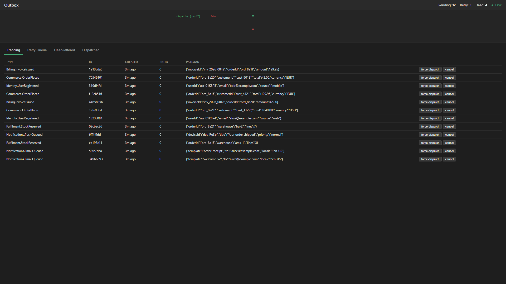
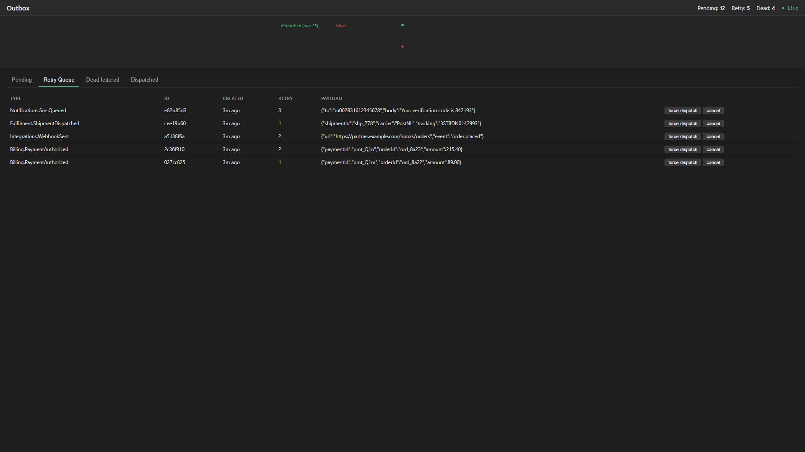
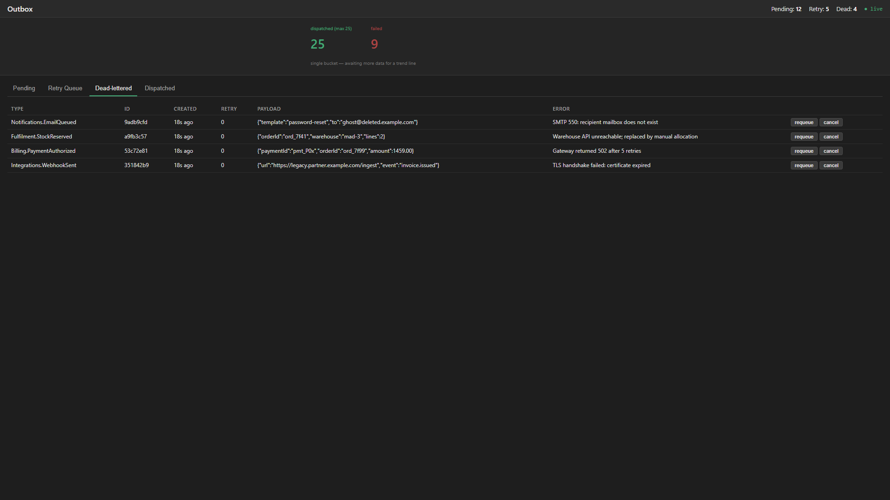
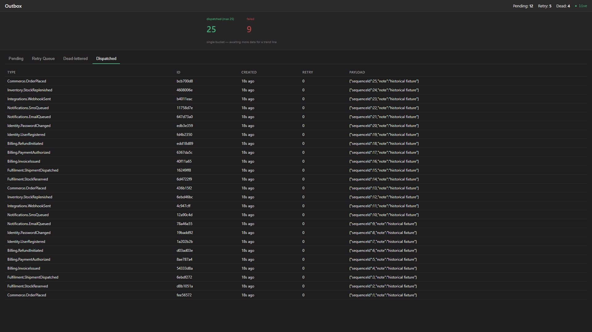

# Dashboard

Operate the outbox at runtime: inspect pending, retry, dead-lettered, and dispatched messages; watch a live throughput chart; and requeue, cancel, or force-dispatch individual messages.

## Install

```bash
dotnet add package ZeroAlloc.Outbox.Dashboard
```

## Wire up

```csharp
// Register the SSE event publisher (required for live updates).
builder.Services.AddOutbox().WithDashboardEvents();

// Map the dashboard under any prefix.
app.MapOutboxDashboard("/outbox");
```

The mapped root (`/outbox`) serves the HTML dashboard. REST endpoints (`snapshot`, `throughput`, `requeue`, `cancel`, `force-dispatch`) and the SSE stream (`events`) live under the same prefix.

## What you see

The dashboard is single-page with four tabs, a live badge ribbon, and a throughput chart that updates from a Server-Sent Events stream.

### Pending

Messages awaiting their first dispatch attempt. Each row shows the message type, the generated ID, enqueue time, attempt counter (always `0/N` on this tab), and the JSON payload. `Force dispatch` makes the message due now; `Cancel` removes it from the queue.

Both actions respect a worker's lease on the message:

- **Force dispatch** on a message a worker has claimed does not take it from that worker. It is dispatched by the holder, or, if the holder crashed, by another host once the lease expires — which can take up to `LeaseDuration`.
- **Cancel** does not stop a dispatch already in flight. The worker finishes it, finds the message gone when it marks the outcome, and reports it on `outbox.lease.lost` with `reason=completed-elsewhere`. The message may therefore still be delivered once.

Every action, including `Requeue` on the Dead-lettered tab, checks the message's state and applies the change in one step. If a worker has dispatched or dead-lettered the message, or another operator has acted on it, since the tab was loaded, the action is rejected with `422` and leaves that outcome in place instead of overwriting it.



### Retry

Messages that failed at least once and are scheduled for a retry. The `Retry` column reads `n/max`, and the `Next attempt` column shows the back-off target derived from `OutboxOptions.RetryBaseDelay`.



### Dead-lettered

Messages that exhausted `MaxAttempts`. The `Error` column carries the last failure reason captured when the worker moved the entry to dead-letter. `Requeue` re-enqueues the message with a fresh attempt counter.



### Dispatched

Recently-succeeded messages — the same series that drives the throughput chart at the top of the page. This is a bounded history window; the store decides the retention.



## Named pipelines

A host that runs [named pipelines](dependency-injection.md#named-pipelines) gets a pipeline selector in the dashboard's header. The selector lists the default pipeline and each named pipeline whose store has an `IOutboxDashboardStore`: `WithEfCore<TContext>()` and `WithInMemoryStore()` register one for a named pipeline, and the ORM store has none. With one pipeline the selector stays hidden.

```csharp
builder.Services.AddOutbox().WithEfCore<AppDbContext>().WithDashboardEvents();
builder.Services.AddOutbox("workflow", configure)
        .WithEfCore<WorkflowDbContext>()
        .WithDashboardEvents();   // live events for this pipeline

app.MapOutboxDashboard("/outbox");
```

Call `WithDashboardEvents()` on each pipeline's builder whose events should stream live. On a named builder it registers a publisher keyed by the pipeline's name, which that pipeline's worker publishes to. Without it, the dashboard still shows the pipeline but marks it "no live events".

Every API endpoint takes an optional `pipeline` query parameter, and serves the default pipeline without it, as before:

- `GET /outbox/api/pipelines` lists the pipelines the dashboard can show, as `[{ "name": null, "events": true }, { "name": "workflow", "events": true }]`. A `null` name is the default pipeline.
- `GET /outbox/api/snapshot?pipeline=workflow`, `api/throughput`, `api/events` and the `POST` actions act on that pipeline's store and publisher. A pipeline without a dashboard store answers `404`, and so does `api/events` for a pipeline without a publisher.

The page opens the pipeline named in its own `?pipeline=` query, so `/outbox?pipeline=workflow` links straight to it.

## Responsive layout

The dashboard is a plain HTML/JS page with no framework — it reflows cleanly to tablet and mobile viewports. Tablet (768 × 1024) and mobile (375 × 812) captures live alongside the desktop ones in [`docs/screenshots/`](screenshots/).

## Security

All write actions are `POST` endpoints:

- `POST /outbox/api/messages/{id}/requeue`
- `POST /outbox/api/messages/{id}/cancel`
- `POST /outbox/api/messages/{id}/force-dispatch`

**Never mount the dashboard unauthenticated in production.** The `IEndpointConventionBuilder` returned by `MapOutboxDashboard` accepts any standard ASP.NET Core auth middleware:

```csharp
app.MapOutboxDashboard("/outbox").RequireAuthorization("AdminPolicy");
```

CSRF protection is the host's responsibility — the dashboard neither emits nor validates anti-forgery tokens. For cookie-based auth schemes, enable `[ValidateAntiForgeryToken]` or the antiforgery middleware.

## Custom events and NativeAOT

The SSE stream writes events with source-generated JSON, so the dashboard works under NativeAOT. The six built-in events are covered. If you derive your own type from `OutboxDashboardEvent` and publish it to the dashboard, register its JSON type info:

```csharp
[JsonSerializable(typeof(OrderShippedEvent))]
internal sealed partial class MyEventsJsonContext : JsonSerializerContext { }

app.MapOutboxDashboard(o => o.EventTypeInfoResolver = MyEventsJsonContext.Default);
```

Create the context with default `JsonSerializerOptions`, so the frames match the built-in ones, which are PascalCase. `OutboxDashboardOptions.BasePath` replaces the `basePath` argument (`/outbox` by default). A custom event whose type is not registered is skipped, the dashboard logs one warning per type, and the stream continues.

## Blazor component

For apps already using Blazor, `ZeroAlloc.Outbox.Dashboard.Blazor` ships an `<OutboxDashboard />` component that embeds the dashboard via `iframe`:

```bash
dotnet add package ZeroAlloc.Outbox.Dashboard.Blazor
```

```razor
@* In any Razor page / component *@
<OutboxDashboard BaseUrl="/outbox" />

@* Opens a named pipeline; the selector can still switch *@
<OutboxDashboard BaseUrl="/outbox" Pipeline="workflow" />
```

You still need `MapOutboxDashboard("/outbox")` on the host — the Blazor component is a thin wrapper around the mapped endpoints.

## Sample

A fully-seeded sample host lives at [`samples/ZeroAlloc.Outbox.DashboardSample`](https://github.com/ZeroAlloc-Net/ZeroAlloc.Outbox/tree/main/samples/ZeroAlloc.Outbox.DashboardSample). It registers `ZeroAlloc.Outbox.InMemory`, seeds messages across every state (pending, retry, dead-letter, dispatched), and strips out `OutboxWorkerService` so the seeded state stays stable while you click through tabs. Run it with:

```bash
dotnet run --project samples/ZeroAlloc.Outbox.DashboardSample
```

and open `http://localhost:5123/outbox/`.
